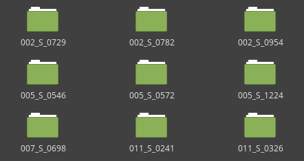
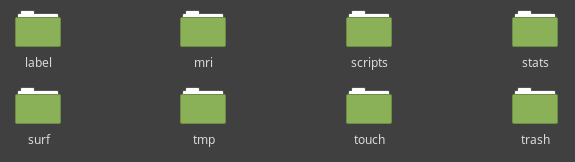

# Imaging pipeline (ENIGMA Shape)
This part is a dockerized version of the [ENIGMA Shape Analysys Project](http://enigma.ini.usc.edu/ongoing/enigma-shape-analysis/ "ENIGMA Shape Site"). You can go to the documentiation at the project's site if you need more information.

To make this structural analysis work is necessary to follo these instructions:

## 1. Get the data ready (Preprocessed dataset)
This software works over a Freesurfer preprocessed folder (after performing a `recon-all` process). After you process your MRI data, you will have a folder that contains all the results in a structure like this:

As you may see, each folder corresponds to one subject's image processed. Inside each folder (subject), you will find a folder structure like this:

## 2. Execute the ENIGMA Shape pipeline
_Before doing so, it is necessary to have Docker installed. See [Docker's documentation](https://docs.docker.com/install/) to get more information. You also will need to fill the CSV file called **groupfile.csv** which contains the subject's IDs (*subj* column) and the diagnosis (*dx* column)._

### 2.1 Setting up the software
To set up the software, you have to set three directory paths in `bin/enigma_shape.sh`

* `FS_DATASET`: Refers to the path of the FreeSurfer processed dataset
* `OUTPUT_FOLDER`: Where the data after the ENIGMA Shape analysis will be stored
* `GROUPFILE_FOLDER`: Where the _groupfile.csv_ file is stored

### 2.2 Run it!
Everything is ready to be run. To do so, you will just need to execute:

	bash bin/enigma_shape.sh

__IMPORTANT!__: If you need to connect through a proxy, you shall execute:

	bash bin/enigma_shape.sh http://[user]:[password]@[proxy-server]:[port]/

## FAQ
### How can I change the regions that are being analysed?
The regions included in the analysis can be changed inside `imaging/enigma_shape/shape_group_run.sh`. You just need to change the variable `setROIS` which by default is set as:

	setROIS="10 11 12 13 17 18 26 49 50 51 52 53 54 58"
